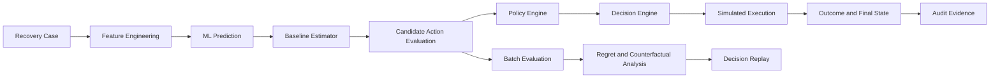

# RECLAIM — Decision Intelligence

> Most recovery systems tell you what action to take. RECLAIM tells you whether it was the right decision.

RECLAIM is a decision-quality engine for financial AI recovery workflows. It evaluates recovery actions against policy constraints, expected value, alternatives, and reproducible simulated outcomes so teams can inspect decision quality rather than treating execution success as proof of quality.

**Public demo:** [reclaim-frontend-5kfi.onrender.com](https://reclaim-frontend-5kfi.onrender.com)

## Why RECLAIM

A recovery agent can execute an action successfully while still making a poor decision. It may choose an ineligible action, spend more than the expected recovery justifies, or miss a better permitted alternative.

RECLAIM makes those questions explicit. It evaluates the decision before simulated execution, compares the selected action with policy-allowed alternatives, and measures realized simulated outcomes and regret on a reproducible benchmark.

## What RECLAIM Does

- Ingests a revenue-at-risk recovery case and its payment context.
- Generates a stable feature vector and an ML recovery-probability estimate.
- Combines the ML estimate with deterministic case and business signals.
- Evaluates the available recovery actions.
- Applies policy eligibility and stopping constraints.
- Compares expected recovery and expected value.
- Selects the best allowed action, or chooses `DO_NOTHING` when policy or economics reject intervention.
- Runs bounded simulated execution for the prototype.
- Evaluates realized simulated outcomes.
- Measures regret against the best policy-allowed realized alternative.
- Persists backend audit evidence.
- Provides deterministic decision replay for a selected benchmark case and seed.
- Compares RECLAIM Hybrid with fixed recovery strategies across multiple seeds.

## Why This Is Different

A generic recovery agent primarily decides and executes. RECLAIM adds an evaluation layer around that workflow:

- Candidate alternatives are evaluated explicitly.
- Policy constraints are visible rather than implicit.
- Expected value makes the economic trade-off measurable.
- Realized simulated outcomes can be compared with decision-time estimates.
- Regret and baseline uplift can be measured.
- Decisions can be replayed and examined with a fixed seed.
- Backend audit evidence records the workflow events.

The result is decision intelligence for recovery workflows, not a claim that a synthetic benchmark is a production experiment.

## Architecture



The backend flow is coordinated by `RecoveryOrchestrator`:

1. `RecoveryProcessRequest` is validated and converted into a `RecoveryCase`.
2. `FeatureEngineering` creates a 16-feature vector.
3. `RecoveryModelPredictor` loads the checked-in LogisticRegression artifact.
4. `BaselineEstimator` computes deterministic action probabilities.
5. `ActionEvaluator` applies policy checks and expected-value calculations.
6. `DecisionEngine` selects the highest-value allowed action.
7. `RecoveryStateMachine` enforces workflow transitions.
8. `ExecutionService` performs bounded simulated execution.
9. `AuditService` persists workflow evidence through `AuditRepository` and SQLite.

The evaluation path is separate and read-only. `EvaluationService` loads `backend/data/cases.csv`, runs the five strategies across seeds 42–46, and exposes summary, strategy, scenario, per-case, and replay APIs.

## Decision Logic

The implemented expected-value model is:

```text
combined probability = 0.60 × baseline probability + 0.40 × ML probability
expected recovery = case amount × combined probability
expected value = expected recovery − action cost
```

The action costs are:

| Action | Cost |
| --- | ---: |
| `RETRY_PAYMENT` | INR 2.00 |
| `CONTACT_CUSTOMER` | INR 15.00 |
| `ESCALATE` | INR 50.00 |
| `DO_NOTHING` | INR 0.00 |

The policy engine applies these constraints:

- Automatic recovery actions are blocked after 30 days since failure.
- `RETRY_PAYMENT` requires a valid payment method and fewer than three failures.
- `CONTACT_CUSTOMER` requires an active customer and fewer than three contact attempts.
- `ESCALATE` requires an amount of at least INR 1,000.
- `DO_NOTHING` is always allowed.

The decision engine selects the highest expected-value allowed action. If no recovery action has positive expected value, it returns `DO_NOTHING` with status `REJECTED`. If all recovery actions are blocked by policy, it returns `DO_NOTHING` with status `BLOCKED_BY_POLICY`.

## Evaluation Framework

The benchmark uses the checked-in synthetic dataset at [backend/data/cases.csv](backend/data/cases.csv):

- 1,000 generated recovery cases.
- Generation seed: `42`.
- Five strategies:
	- `RECLAIM Hybrid`
	- `Always Retry`
	- `Always Contact`
	- `Always Escalate`
	- `Do Nothing`
- Five outcome seeds: `42`, `43`, `44`, `45`, and `46`.
- Policy-constrained candidate actions.
- Deterministic SHA-256-derived outcome randomness based on seed, case ID, and action.

The outcome simulator represents reproducible evaluation ground truth. It does not represent live payment settlements. Regret compares the selected action's realized simulated net value with the best realized net value among policy-allowed actions.

Incremental recovered amount and incremental net value compare RECLAIM Hybrid with the best fixed baseline. They are benchmark differences, not causal production uplift.

## Results

The following are the current multi-seed results from `backend/data/batch_results.json` and the evaluation API. All amounts and outcomes are synthetic/reproducible benchmark values.

| Metric | RECLAIM Hybrid result |
| --- | ---: |
| Dataset size | 1,000 cases |
| Seeds | 42–46 (5 runs) |
| Case recovery rate | 39.3% |
| Best baseline | Always Retry |
| Best baseline recovery rate | 35.4% |
| Incremental recovered amount vs best baseline | INR 271,001.37 simulated |
| Incremental net value vs best baseline | INR 254,506.37 simulated |
| Policy compliance | 100% in the benchmark |
| Average regret | INR 1,340.026 simulated |
| Regret rate | 41.3% |

These values should be described as simulated or benchmark results. They must not be described as real money recovered or evidence of production causal uplift.

## Product Walkthrough

| Page | What it demonstrates |
| --- | --- |
| [Overview](https://reclaim-frontend-5kfi.onrender.com/) | Live evaluation summary metrics and a small set of evaluated cases. |
| [Decision Studio](https://reclaim-frontend-5kfi.onrender.com/decision-studio) | Case submission, policy checks, ML probability, candidate comparison, expected value, and decision explanation. Execution is explicitly simulated. |
| [Recovery Cases](https://reclaim-frontend-5kfi.onrender.com/cases) | Backend-backed per-case evaluation results, selected actions, outcomes, and regret. |
| [Evaluation Lab](https://reclaim-frontend-5kfi.onrender.com/evaluation) | Strategy comparison, multi-seed robustness, scenarios, recovery uplift, net value, and regret. |
| [Decision Replay](https://reclaim-frontend-5kfi.onrender.com/replay) | Deterministic recomputation of a benchmark case and seeded candidate outcomes. |
| [Audit Trail](https://reclaim-frontend-5kfi.onrender.com/audit) | Backend audit evidence with timestamps, case IDs, event types, and messages. |

## Example Decision

`BATCH-000001` is a useful example of the principle **prediction is not permission**:

- Amount: INR 611.54.
- Payment status: `EXPIRED`.
- Days since failure: 54.
- Retry, contact, and escalation are blocked by the automatic recovery window.
- `DO_NOTHING` is the only allowed action.
- The selected action is `DO_NOTHING`.
- Decision status: `REJECTED` because no allowed recovery action has positive expected value.
- Regret: INR 0.00 for seed `42`.
- Best realized action: `DO_NOTHING`.

The model can estimate recovery probability, but that estimate does not override policy eligibility.

## Demo

Recommended five-minute path:

1. Open [Decision Studio](https://reclaim-frontend-5kfi.onrender.com/decision-studio) and submit the default failed-payment case.
2. Show the ML probability, policy checks, candidate actions, expected value, and selected decision.
3. Point out the simulated-execution disclosure and explain that no live payment or customer contact is initiated.
4. Open [Evaluation Lab](https://reclaim-frontend-5kfi.onrender.com/evaluation) to show the synthetic 1,000-case, five-seed benchmark.
5. Open [Decision Replay](https://reclaim-frontend-5kfi.onrender.com/replay), select `BATCH-000001`, and use seed `42`.
6. Open [Audit Trail](https://reclaim-frontend-5kfi.onrender.com/audit) to show backend workflow evidence when available.

## Technology

- **Frontend:** React, TypeScript, Vite, React Router, Lucide React.
- **Backend:** Python 3.11.9, FastAPI, Uvicorn, Pydantic, pydantic-settings, python-dotenv.
- **ML:** NumPy 1.26.4, scikit-learn 1.3.2, joblib 1.3.2, LogisticRegression.
- **Persistence:** SQLite for runtime audit evidence.
- **Deployment:** Render Static Site for the frontend and Render Web Service for the backend, using the existing relative `/api/v1` paths through same-origin proxying.

## Local Development

### Backend

Use Python 3.11.9. From the repository root:

```powershell
cd backend
python -m venv .venv
.\.venv\Scripts\Activate.ps1
pip install -r requirements.txt
uvicorn app.main:app --reload --host 127.0.0.1 --port 8000
```

The backend serves its API at `http://127.0.0.1:8000`. Runtime audit evidence is created in `data/reclaim.db` relative to the backend working directory and is ignored by Git.

### Frontend

In a second terminal:

```powershell
cd frontend
npm ci
npm run dev
```

The Vite development server runs at `http://127.0.0.1:5173` and proxies `/api` and `/health` to the local backend. The production build is:

```powershell
npm run build
```

The build output is `frontend/dist`.

### Batch evaluation

From `backend/`:

```powershell
python run_batch.py --seeds 42,43,44,45,46 --output data/batch_results.json
```

The command evaluates the existing dataset and writes structured benchmark output when an output path is supplied. The checked-in `batch_results.json` is a benchmark artifact, not live operational data.

### Model training

The existing artifact is already checked in at `backend/models/recovery_probability_model.joblib`. To reproduce training with the pinned ML dependencies, run from `backend/`:

```powershell
python -m app.ml.train_model
```

Training uses 5,000 synthetic samples and seed `42`. It regenerates the model artifact, so it is not part of the normal demo startup flow.

## API

The FastAPI application is mounted under `/api/v1`.

| Method | Endpoint | Purpose |
| --- | --- | --- |
| `GET` | `/health` | Backend health check. |
| `GET` | `/` | API root status. |
| `POST` | `/api/v1/recovery/process` | Process one recovery case through the decision workflow and simulated execution. |
| `GET` | `/api/v1/recovery/audit` | Return all persisted audit evidence. |
| `GET` | `/api/v1/recovery/{case_id}/audit` | Return audit evidence for one case. |
| `GET` | `/api/v1/evaluation/summary` | Return dataset, seed, strategy, recovery, compliance, regret, and uplift summary. |
| `GET` | `/api/v1/evaluation/strategies` | Return per-strategy benchmark metrics. |
| `GET` | `/api/v1/evaluation/multiseed` | Return multi-seed strategy metrics. |
| `GET` | `/api/v1/evaluation/scenarios` | Return scenario-level strategy metrics. |
| `GET` | `/api/v1/evaluation/cases` | Return per-case evaluation results; supports strategy, scenario, and limit filters. |
| `GET` | `/api/v1/evaluation/replay/{case_id}?seed=42` | Return deterministic candidate outcomes and regret for a benchmark case. |

## Limitations / Non-goals

- Execution is simulated for this buildathon prototype.
- No live Razorpay payment retry is performed.
- No live customer contact or external escalation is performed.
- The Razorpay adapter is not a live payment integration.
- Evaluation cases, training labels, and outcomes are synthetic.
- Benchmark results are not production causal evidence or a guarantee of recovery.
- Expected recovery and expected value are decision-time estimates; realized outcomes are simulator outputs.
- Decision Replay recomputes a benchmark decision and seeded counterfactual outcomes; it is not historical production event replay.
- Audit Trail provides backend audit evidence through SQLite. It is not cryptographically tamper-proof or guaranteed immutable.
- SQLite is runtime-local and may not provide durable history on an ephemeral deployment filesystem.
- The prototype does not claim production authentication, authorization, multi-tenancy, live webhooks, or production readiness.

## Buildathon Context

RECLAIM is built for the **Razorpay AI Buildathon, Track 03 — AI Revenue Recovery**.

It fits the track by providing decision intelligence around recovery workflows: deciding when intervention is appropriate, comparing bounded alternatives, measuring expected and realized value, respecting policy constraints, and producing inspectable evidence. It is not presented as a live Razorpay product or payment integration.

## Demo Link

**[Open the public RECLAIM demo](https://reclaim-frontend-5kfi.onrender.com)**

The public product is the frontend URL above. The backend is deployed separately behind the same-origin `/api/*` rewrite used by the frontend.

## Repository Structure

```text
backend/
	app/
		api/              FastAPI routes and response schemas
		evaluation/       Dataset loading, simulation, strategies, metrics, replay
		ml/               Feature engineering, training, artifact loading, prediction
		models/           Case, decision, execution, and audit domain models
		services/         Policy, action evaluation, decision, execution, audit, orchestration
		state_machine/    Recovery workflow states and transitions
	data/
		cases.csv         1,000-case synthetic evaluation dataset
		batch_results.json Checked-in benchmark output
	models/
		recovery_probability_model.joblib
	tests/              Backend tests
	run_batch.py        Batch evaluation CLI
frontend/
	src/
		pages/            Overview, Decision Studio, Cases, Evaluation, Replay, Audit
		services/         Backend API client
		types/            TypeScript API contracts
	package.json
	vite.config.ts
README.md
.python-version
```

## Status

RECLAIM is a **buildathon prototype/demo** with simulated execution and reproducible synthetic evaluation. Its central demonstration is that a recovery decision should be judged against policy, economics, alternatives, and outcomes, not only by whether an action appears to succeed.
